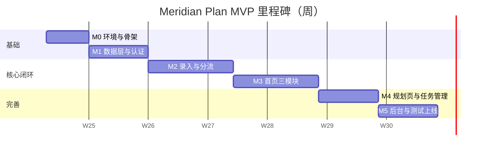

# Meridian Plan 开发计划

> 版本：MVP v1.0  
> 依据：`requirements.md` · `data-model.md` · `routes.md` · `plan.md`  
> 目标：6～8 周交付可上线的个人规划 MVP（单人全职估算；兼职可 ×1.5～2）

---

## 1. 项目目标与交付物

### 1.1 MVP 要交付什么

用户注册登录后，在一个首页同时「看动态、看全局、看执行」：

- 创建 **goal → phase → weekly/daily** 计划层级，并挂载任务
- 任务支持父子关系（最多 3 层）
- **无日期** → 备忘录；**有 start** → 日历 + 甘特图（虚拟截止 `max(start+365, today)`）
- 填写确定 due/end 后，甘特图切换为真实截止
- 管理员后台：用户列表、订阅手动维护

### 1.2 不在 MVP

复盘、真实支付、订单流水、运营配置、邮件通知、多语言。

### 1.3 最终交付清单

| 交付物 | 说明 |
|--------|------|
| 可运行 Next.js 应用 | 本地 + 一种部署方式（Vercel 或 Docker） |
| PostgreSQL 数据库 | 迁移脚本 / Prisma schema |
| 文档 | requirements / data-model / routes / plan / 本开发计划 |
| 测试 | content-router 单元测试 + 分流集成测试 |
| 种子数据脚本 | 1 个 admin + 1 个 demo 用户 |

---

## 2. 技术方案（锁定）

| 层 | 选型 | 理由 |
|----|------|------|
| 框架 | Next.js 14+ App Router + TypeScript | 需求指定；前后端一体 |
| 样式 | Tailwind CSS + 自研基础组件 | 轻量、可控 |
| ORM | Prisma | 类型安全、迁移友好 |
| 数据库 | PostgreSQL（本地 Docker / Supabase 二选一） | 关系型适合层级与 Feed |
| 认证 | NextAuth.js v5 或 Lucia + 邮箱密码 | Session + role 校验 |
| 日历 | react-big-calendar | 月/周/日视图成熟 |
| 甘特图 | frappe-gantt 或 gantt-task-react | 时间条 + 层级可扩展 |
| 校验 | Zod | 表单与 API 共用 schema |
| 测试 | Vitest + Playwright（冒烟） | router 单测 + 关键路径 E2E |

**核心模块（必须先建）：**

```
lib/content-router.ts    ← 分流决策表 + getEffectiveEndDate
lib/services/task.ts     ← CRUD + Feed + Memo 联动
lib/services/plan.ts
lib/services/memo.ts
lib/services/feed.ts
```

---

## 3. 里程碑总览



| 里程碑 | 名称 | 工期 | 完成标志 |
|--------|------|------|----------|
| **M0** | 环境与骨架 | 3～5 天 | `npm run dev` 正常；路由骨架可点 |
| **M1** | 数据层与认证 | 5～7 天 | 注册登录；Prisma 六表迁移成功 |
| **M2** | 录入与分流 | 7～10 天 | 决策表 100% 通过单测；Memo 联动正确 |
| **M3** | 首页三模块 | 7～10 天 | Feed / Gantt / Calendar 真实数据 |
| **M4** | 规划页与任务管理 | 5～7 天 | 长期/短期规划页 + 任务 CRUD 完整 |
| **M5** | 后台与测试上线 | 5～7 天 | Admin 可用；测试绿；可部署 |

**合计：约 32～46 个工作日（6～9 周）**

---

## 4. 分阶段详细计划

### M0：环境与骨架（第 1 周）

**目标：** 空壳应用跑起来，所有页面路由占位。

| 序号 | 任务 | 产出 | 估时 |
|------|------|------|------|
| 0.1 | `create-next-app` + ESLint + Tailwind + 目录结构 | 仓库初始化 | 0.5d |
| 0.2 | 按 `routes.md` 创建页面占位 | 12 个路由空页 | 1d |
| 0.3 | 全局 Layout：顶栏 + 侧栏 + 移动底 Tab | `(app)/layout.tsx` | 1d |
| 0.4 | 基础 UI 组件库（Button/Input/Modal 等） | `components/ui/*` | 1.5d |
| 0.5 | 首页三区域静态骨架（桌面/移动） | `/` 布局完成 | 1d |

**验收：** 未登录访问 `/` 跳转 login；各导航链接不 404。

---

### M1：数据层与认证（第 2 周）

**目标：** 数据库与登录打通，权限隔离就绪。

| 序号 | 任务 | 产出 | 估时 |
|------|------|------|------|
| 1.1 | Prisma schema（6 模型 + 关系 + enum） | `schema.prisma` | 1d |
| 1.2 | 首次迁移 + seed（admin + demo user） | `prisma/seed.ts` | 0.5d |
| 1.3 | 注册 / 登录 / 登出 / session API | `/api/auth/*` | 1.5d |
| 1.4 | Middleware：登录守卫 + admin 403 | `middleware.ts` | 0.5d |
| 1.5 | `content-router.ts` 骨架 + 类型定义 | `lib/content-router.ts` | 1d |
| 1.6 | Zod schema（Task/Plan/Memo 校验规则） | `lib/validations/*` | 1d |

**验收：**

- 两用户互不可见对方数据
- `due without start` 在 Zod 层被拒绝
- admin 账号 role=admin 可识别

---

### M2：录入与分流（第 3～4 周）⭐ 关键路径

**目标：** 业务核心闭环——创建/更新 → Feed + Memo + 视图资格。

| 序号 | 任务 | 产出 | 估时 |
|------|------|------|------|
| 2.1 | Task CRUD API + 分流钩子 | `/api/tasks` | 2d |
| 2.2 | Plan CRUD API（type / parent 校验） | `/api/plans` | 1.5d |
| 2.3 | Memo 自动创建 / 硬删除 / 标题同步 | `lib/services/memo.ts` | 1.5d |
| 2.4 | Feed 写入（create/update/complete/archive） | `lib/services/feed.ts` | 1d |
| 2.5 | `getEffectiveEndDate` + 决策表完整实现 | 单测先行 | 1d |
| 2.6 | 新增任务 / 计划表单页 | `/tasks/new` + Modal | 2d |
| 2.7 | content-router **单元测试**（决策表每一行 + 虚拟截止跨日期） | `*.test.ts` | 1d |

**验收（必须全部通过）：**

```
✓ 无日期任务 → Memo 存在，不进 calendar/gantt API
✓ 仅有 start → calendar ✓，gantt 带 is_virtual_end=true
✓ start+due → gantt 用真实 due
✓ 补 start → Memo 删除
✓ 清空日期 → Memo 重建
✓ 改 title → Memo.title 同步
```

---

### M3：首页三模块（第 4～5 周）

**目标：** 产品核心体验——三块同页可用。

| 序号 | 任务 | 产出 | 估时 |
|------|------|------|------|
| 3.1 | `/api/feed` 分页 + Feed 列表组件 | 信息流 | 1.5d |
| 3.2 | `/api/gantt` + frappe-gantt 集成 | 甘特图 | 3d |
| 3.3 | 虚拟截止虚线样式 + 「预估截止」标签 | Gantt 样式 | 0.5d |
| 3.4 | `/api/calendar` + react-big-calendar | 日历 | 2d |
| 3.5 | 首页整合：桌面三栏 + 移动 Tab | `/` 完成 | 1.5d |
| 3.6 | 条目点击 → 详情 Drawer / 跳转 | 交互 | 1d |

**验收：**

- demo 用户登录后首页三块有数据
- 虚拟截止条与真实截止条视觉可区分
- 移动端 Tab 切换流畅

**风险：** 甘特图父子层级可能是本阶段最大技术点；若 frappe-gantt 层级不足，降级为「按计划分组平铺」，v1.1 再嵌套。

---

### M4：规划页与任务管理（第 6 周）

**目标：** 除首页外的主要工作页补齐。

| 序号 | 任务 | 产出 | 估时 |
|------|------|------|------|
| 4.1 | 长期规划页 goal→phase 树 + 关联任务 | `/plans/long` | 2d |
| 4.2 | 短期计划页 weekly/daily | `/plans/short` | 1d |
| 4.3 | 计划详情页 | `/plans/[id]` | 1d |
| 4.4 | 任务列表 / 详情 / 编辑 | `/tasks/*` | 2d |
| 4.5 | 父任务选择器 + 3 层限制 + 汇总状态展示 | 组件 | 1d |
| 4.6 | 备忘录列表 + 补日期回流 UI | `/memos` | 1d |

**验收：** 走通场景——创建 goal → phase → 任务（无日期进 Memo）→ 补 start → 首页三处可见。

---

### M5：后台、测试与上线（第 7～8 周）

**目标：** MVP 可交付。

| 序号 | 任务 | 产出 | 估时 |
|------|------|------|------|
| 5.1 | Admin 用户列表 / 详情 / 启用禁用 | `/admin/users` | 1.5d |
| 5.2 | Admin 订阅列表 / 手动 PATCH | `/admin/subscriptions` | 1d |
| 5.3 | 集成测试（分流 + Memo + 权限） | Vitest | 1.5d |
| 5.4 | E2E 冒烟（注册→建任务→首页可见） | Playwright 3 条 | 1d |
| 5.5 | 环境变量文档 + 部署 | README + Vercel | 1d |
| 5.6 | Bug 修复缓冲 | — | 2d |

**验收：** `requirements.md` 第 11 节 12 条验收标准全部满足。

---

## 5. 推荐目录结构

```
meridian-plan/
├── app/
│   ├── (auth)/login, register
│   ├── (app)/              # 用户端（需登录）
│   │   ├── page.tsx        # 首页
│   │   ├── tasks/
│   │   ├── plans/
│   │   └── memos/
│   ├── admin/              # 后台
│   └── api/                # Route Handlers
├── components/
│   ├── ui/                 # 基础组件
│   ├── feed/
│   ├── gantt/
│   ├── calendar/
│   └── forms/
├── lib/
│   ├── content-router.ts   # ⭐ 分流核心
│   ├── services/
│   ├── validations/
│   └── auth/
├── prisma/
│   ├── schema.prisma
│   └── seed.ts
├── types/
├── docs/
└── tests/
```

---

## 6. 依赖关系（必须先后的顺序）

```
M0 骨架
 └─► M1 数据库 + 认证
      └─► M2 content-router + CRUD + Memo 联动  ◄── 不可跳过
           ├─► M3 首页三模块（依赖 API）
           └─► M4 规划页 / 任务页（可与 M3 部分并行）
                └─► M5 后台 + 测试
```

**可并行项（若两人协作）：**

- M3 日历 vs M3 甘特图（不同人）
- M4 长期规划页 vs M4 任务列表页
- M5 后台 vs M5 E2E 测试编写

---

## 7. 每周执行节奏（单人推荐）

| 周 | 聚焦 | 周末检查点 |
|----|------|------------|
| W1 | M0 + M1 前半 | 能登录，表已建 |
| W2 | M1 完成 + M2 启动 | Task POST 能写 Feed |
| W3 | M2 分流 + 单测 | 决策表测试全绿 |
| W4 | M2 表单 + M3 Feed/Gantt 启动 | 甘特图出第一条 bar |
| W5 | M3 Calendar + 首页整合 | 首页三块有数据 |
| W6 | M4 全部页面 | 走完 goal→task 场景 |
| W7 | M5 后台 + 集成测试 | Admin 可用 |
| W8 | 部署 + 缓冲 + 修 bug | MVP 上线 |

---

## 8. 风险与对策

| 风险 | 影响 | 对策 |
|------|------|------|
| 甘特图库不支持层级 | M3 延期 2～3 天 | 先平铺；计划分组着色 |
| Memo 与 Task 双写不同步 | 数据不一致 | 所有写操作只走 service 层，禁止页面直写 DB |
| 虚拟截止理解偏差 | 验收扯皮 | 以 `data-model.md` 公式为准，单测锁死 |
| 首页三模块性能 | 首屏慢 | gantt/calendar 分 API，首页 lazy load |
| 范围蔓延（复盘/支付） | 无法按时交付 | 严格对照 MVP 清单，v2  backlog |

---

## 9. Definition of Done（每个 PR / 任务）

- [ ] 符合 `data-model.md` 字段，未私自增删
- [ ] 分流改动更新/通过 `content-router` 测试
- [ ] 新 API 有 Zod 校验 + user_id 过滤
- [ ] 本地 `npm run dev` + `npm test` 通过
- [ ] 无 console.error；TypeScript 无 any 滥用
- [ ] 简要说明：改了什么、怎么测

---

## 10. v2 Backlog（MVP 后）

| 优先级 | 功能 |
|--------|------|
| P1 | 复盘模块（Review 表 + Feed） |
| P1 | 甘特图真正嵌套拖拽 |
| P2 | 真实支付（Stripe / 微信） + Order 表 |
| P2 | 邮件提醒 / 到期通知 |
| P3 | 导出（ICS / PDF） |
| P3 | DEFAULT_GANTT_SPAN_DAYS 用户可配置 |

---

## 11. 下一步行动（Day 1）

1. 初始化 Next.js 项目到 `d:\Mylifeplan`（保留现有 `docs/`）
2. 配置 Docker PostgreSQL 或 Supabase 项目
3. 完成 M0.1～M0.3（骨架 + 路由占位）
4. 第一个 PR：**「chore: project scaffold + route skeleton」**

---

## 12. 与 `plan.md` 的关系

| 文档 | 用途 |
|------|------|
| **development-plan.md**（本文件） | 里程碑、工期、依赖、风险、节奏 |
| **plan.md** | Cursor 逐任务执行清单与验收标准 |

开发时：**先看本计划把握进度 → 按 plan.md 逐项执行 → 对照 requirements 验收。**
