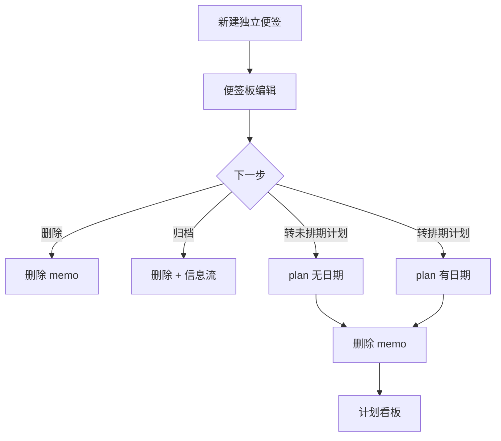

# 记录流转说明

本文描述 **B + 少量 A** 产品模型下，各类记录在系统中的创建、展示、变更与删除路径。

## 核心概念

系统里有三类**主记录**：

| 类型 | 存储 | 一句话 |
|------|------|--------|
| **独立便签** | `memo`（`linkedPlanId = null`） | 碎片想法，还不是计划 |
| **计划** | `plan` | 可排期、可拆解、可进甘特 |
| **贡献** | `plan_contribution` | 挂在某个计划下的执行记录 |

计划另有三个**正交维度**（不是三种记录）：

| 维度 | 取值 | 作用 |
|------|------|------|
| **执行状态** `status` | `not_started` / `in_progress` / `done` / `archived` | 做到哪一步 |
| **是否排期** | 有/无 `startDate` 与 `endDate` | 能否上甘特时间轴 |
| **看板列** | 由上面两者推导 | 仅 UI 分组，不是数据库字段 |

**重要原则（B 模型）**

- 便签与计划**不再自动双向同步**；不存在「看不见的关联便签」。
- **未排期** = 已是计划，但无日期 → 计划看板紫色列。
- **已归档** = `status = archived` → 看板底部折叠区，不进日常四列。
- 独立便签要变成计划，只能走 **「转为计划」**（未排期或立即排期）。

---

## 一、独立便签（Memo）

### 在哪里出现

| 界面 | 条件 |
|------|------|
| 便签四象限板 | 始终（`standaloneOnly`） |
| 信息流 | 创建/更新/归档便签时 |
| 计划看板 | **不出现** |
| 甘特图 | **不出现** |

### 创建入口

- 便签板「+」新建
- 信息流 → 发便签
- `POST /api/memos`（content / empty / quadrant）

### 流转线路

| # | 操作 | 结果 |
|---|------|------|
| M1 | 新建 | `memo` 落便签板，可选四象限 |
| M2 | 编辑正文/象限 | 更新 `memo`，可能写信息流 |
| M3 | 删除 | `memo` 消失 |
| M4 | 归档 | 删除 `memo`（独立便签无 plan） |
| M5 | **转为计划·未排期** | 新建 `plan`（无日期，`not_started`）→ 删 `memo` → 看板「未排期」 |
| M6 | **转为计划·立即排期** | 新建 `plan`（有日期）→ 删 `memo` → 看板「未开始」+ 甘特 |



---

## 二、计划（Plan）

### 在哪里出现

| 界面 | 条件 |
|------|------|
| 计划看板 | `status ≠ archived` |
| 甘特图 | 有 `startDate`（未排期为占位/虚线） |
| 日历 | 有 `startDate` |
| 信息流 | 创建/更新/完成/归档 |
| 便签板 | **不出现** |

### 看板四列判定

1. **已完成** → `status = done`
2. **未排期** → 无 start 且无 end，且 `status ≠ done`
3. **进行中** → 有排期且 `status = in_progress`
4. **未开始** → 有排期且 `status = not_started`

有子计划时，父计划状态可汇总，且**不可拖动**。

### 流转线路

| # | 操作 | 数据变化 | 界面 |
|---|------|----------|------|
| P1 | 新建无日期 | `not_started`，日期空 | 看板·未排期 |
| P2 | 新建有日期 | `not_started` + 日期 | 看板·未开始，甘特 |
| P3 | 看板拖列 | 按列 patch status/日期 | 列变化 |
| P4 | 拖入未排期 | 清空日期 | 未排期（**有贡献时禁止**） |
| P5 | 拖入已归档区 | `status=archived` | 底部归档 |
| P6 | 从归档恢复 | 按目标列恢复 | 回到四列 |
| P7 | 甘特/详情改状态 | `status` 变更 | 颜色、列联动 |
| P8 | 删除计划 | 计划删除 | 各视图消失 |

### 子计划

- 子计划无日期：留在计划树/甘特，**不进便签板**
- 父计划：状态由子计划汇总

---

## 三、贡献（Contribution）

| # | 操作 | 说明 |
|---|------|------|
| R1 | 新建 | 绑定 `planId`，写信息流 |
| R2 | 编辑 | 改内容、时间、所属计划 |
| R3 | 删除 | 从计划与信息流移除 |
| R4 | 信息流 | 内联展示 |

有计划贡献后，该计划**不能**拖回「未排期」。

---

## 四、信息流（Feed）

动态镜像，不是第四种记录。便签/计划/贡献的创建与变更会写入 Feed；展示为内联卡片，非弹窗。

---

## 五、颜色对照

| 语义 | 看板 | 甘特 | 数据库要点 |
|------|------|------|------------|
| 未排期 | 紫 | 紫虚线 | 无日期 |
| 未开始 | 琥珀 | 琥珀 | 有日期，`not_started` |
| 进行中 | 蓝 | 蓝 | `in_progress` |
| 已完成 | 绿 | 绿 | `done` |
| 已归档 | 灰（底部） | 灰 | `archived` |
| 超期 | — | 红 | 过期未完成 |

---

## 六、入口选择

| 你想… | 用这个 |
|--------|--------|
| 快速记一句，还不当是正式计划 | 便签板 / 信息流·便签 |
| 已是计划，还没想好时间 | 计划无日期 / 便签→未排期 |
| 已定时间，上甘特 | 计划填日期 / 看板拖出未排期 |
| 记录执行过程 | 贡献 |
| 不再跟进 | 看板归档 / 详情归档 |

---

## 七、历史数据

`memo.linkedPlanId` 非空的旧关联便签会在计划更新时由 `syncMemoForPlan` 清理，或执行：

```sql
DELETE FROM memos WHERE linked_plan_id IS NOT NULL;
```

---

## 相关代码

| 模块 | 文件 |
|------|------|
| 便签/计划分离 | `lib/services/memo-sync.ts` |
| 看板列 | `lib/kanban-board.ts` |
| 排期判定 | `lib/content-router.ts` |
| 便签转计划 | `lib/services/memo.ts` |
| 颜色 | `lib/task-status-style.ts` |
